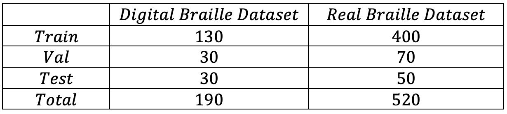

# Deep Learning Based Optical Braille Recognition

인하대학교 시각 컴퓨팅 및 학습 연구실에서 학부 연구생으로서
2022.01 ~ 2022.06까지 진행한 **'딥러닝 기반 전이학습을 이용한 점자인식'** 프로젝트입니다.

---

## Introduction

1. 점자 데이터 셋을 직접 구성 

- 약 200장의 디지털 점자 데이터 셋
- 520장의 실물 점자 데이터 셋
- 카메라 거리와 점자의 개수, 위치 등 여러 변수 통제

2. CLAHE, Erosion, Dilation 등을 적용해 이미지 전처리를 진행

3. Pytorch에서 제공하는 모델인 Faster-RCNN-FPN-ResNet50 사용 (Pretrained = True)

4. $mAP_{50}$ 가 약 94%가 나오며 전처리를 이용해 많은 성능 향상을 이뤄냄

## Result

---

## Paper

GEP-133 대한전자공학회 2022 하계종합학술대회, ‘딥러닝 기반 전이학습을 이용한 점자 인식’, pp.1060

---

## Reference

- Feature Pyramid Networks for Object Detection - Tsung-Yi Lin et al.
- Optical Braille Recognition Using Object Detection CNN – Ilya G. Ovodov
- Deep Learning Strategy for Braille Character Recognition – Kausar, Tasleem et al.
- Faster R-CNN: Towards Real-Time ObjectDetection with Region Proposal Networks Shaoqing Ren, Kaiming He, Ross Girshick, and Jian Sun
- M. Hanumanthappa and V. V. Murthy, "Optical Braille recognition and its correspondence in the conversion of Braille script to text — A literature review," 2016 International Conference on Computation System and Information Technology for Sustainable Solutions (CSITSS), 2016, pp. 297-301, doi: 10.1109/CSITSS.2016.7779374.
- Buslaev, A., Iglovikov, V. I., Khvedchenya, E., Parinov, A., Druzhinin, M., & Kalinin, A. A. (2020).
- Albumentations: fast and flexible image augmentations. Information, 11(2), 125.
- Smart Braille System Recognizer Aisha Mousa, Hazem Hiary, Raja Alomari, and Loai Alnemer King Abdullah II School for Information Technology, The University of Jordan Amman, 11942, Jordan
- B. Nugroho, I. Ardiyanto and H. A. Nugroho, "Review of Optical Braille Recognition Using Camera for Image Acquisition," 2018 2nd International Conference on Biomedical Engineering (IBIOMED), 2018